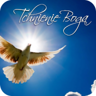

# Tchnienie Boga - Songbook

Digital songbook for the **Tchnienie Boga** parish schola. This application serves as a central resource for liturgical music, helping our members prepare for Holy Mass, adorations, and parish events.

🔗 **Live Application:** [spiewnik.tchnienieboga.pl](https://spiewnik.tchnienieboga.pl)

---

## ⛪ About the Project

This application is designed to support the liturgical ministry of the schola. It provides a fast, mobile-friendly interface to access lyrics and chords, ensuring that all members have the most up-to-date versions of songs for service.

### Features
* **Smart Search:** Quickly find songs by entering their assigned number or a fragment of the title.
* **Setlist Management:** Mark and organize specific songs to be performed during upcoming events for quick access.
* **Intuitive Touch Gestures:** Optimized for tablet and mobile use:
   * **Pinch-to-Zoom:** Easily adjust text size for better readability.
   * **Swipe Navigation:** Seamlessly switch between songs using gestures.
* **PWA (Progressive Web App):** Enjoy seamless version updates and reliable offline access within the church.
* **Responsive Design:** Optimized for smartphones and tablets used on music stands.
---

## 🛠️ Technical Stack

* **Framework:** [React](https://reactjs.org/)
* **Build Tool:** [Vite](https://vitejs.dev/)
* **Language:** [TypeScript](https://www.typescriptlang.org/)
* **Hosting:** [GitHub Pages](https://docs.github.com/en/pages)

---

## 🚀 Getting Started
To run this project locally, follow these steps:

Make sure you have [Node Version Manager](https://github.com/nvm-sh/nvm) or [Node.js](https://nodejs.org/) installed on your machine. 

### Installation
1. Clone the repository:
   ```bash
   git clone https://github.com/tchnienieboga/songbook.git

2. (_Optional_) Install Node using Node Version Manager:
   ```bash
   nvm install

3. Install dependencies:
   ```bash
   npm install

4. Run development server
   ```bash
   npm run start

---

## Information
This project is a ministry tool for the **Tchnienie Boga** schola. All liturgical texts and songs are used solely for prayer and worship purposes within the Catholic Church.
